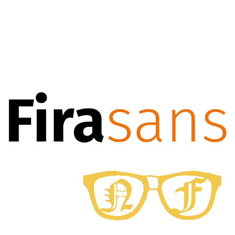

# Mozilla's Fira Type Family



http://mozilla.github.io/Fira/

## Download Fira
https://github.com/mozilla/Fira/releases/latest - Latest Release
https://github.com/mozilla/Fira/releases - All Releases

## Fira Roadmap
See the  https://docs.google.com/document/d/1fLxzQsULTv43umIhpB9Gv3Gi7aOBONHbqEbwZIipmxw/edit - Fira Road Map for further information on upcoming releases. Please add your comments or questions within the document.


## How to Contribute to Fira
If you're interested in contributing, see our  https://docs.google.com/document/d/1QfxweGktJEdBvbd94y-5hiyqu32U9-h_ICPVs76Niyw/edit - Fira Contribution Documentation. Please add your comments or questions within the document.


## Usage
Use this font on your website!

```html
link rel="stylesheet" href="https://code.cdn.mozilla.net/fonts/fira.css"/>
```

## External Resources
Further information on the design and specifications of the Fira typeface can be found at https://carrois.com/typefaces/FiraSans/ - Carrois Studio.
Fira can also be found in these foundries:
http://www.1001fonts.com/fira-sans-font.html - 1001 Fonts.
https://typekit.com/fonts/fira-sans - Adobe Typekit.
https://www.google.com/fonts/specimen/Fira+Sans - Google Fonts.
https://www.fontsquirrel.com/fonts/fira-sans - Font Squirrel.
